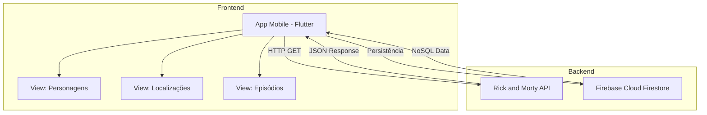

# 🛸 Rick and Morty Explorer - Flutter App

Uma aplicação mobile desenvolvida em Flutter que permite explorar o universo da série Rick and Morty. O app consome a API oficial para listar personagens, localizações e episódios, permitindo a paginação manual e a persistência de favoritos em tempo real utilizando Firebase.

### Componentes Principais:
- **Camada de Interface (UI):** Construída com Widgets Materiais, utilizando `ListView.builder` para renderização eficiente.
- **Gerenciamento de Dados:** Controle de paginação via links `info.next` da API.
- **Integração Externa:** Serviço de requisições via pacote `http` e salvamento assíncrono no Firestore.

---

## ✨ Tecnologias Utilizadas

- **Linguagem:** [Dart](https://dart.dev/)
- **Framework:** [Flutter](https://flutter.dev/)
- **Consumo de API:** [HTTP Package](https://pub.dev/packages/http)
- **Backend/Database:** [Firebase Cloud Firestore](https://firebase.google.com/docs/firestore)
- **JSON Parsing:** `dart:convert`

---

## 📸 Screenshots da Aplicação

> **Nota:** Coloque as imagens na pasta `assets/screenshots/` do seu repositório para que apareçam abaixo.

| Lista de Personagens | Botão Buscar Mais | Localizações |
| :---: | :---: | :---: |
|  |  |  |

---

## 🚀 Como Executar o Projeto

### Pré-requisitos
- Flutter SDK instalado (versão estável).
- Emulador Android/iOS ou dispositivo físico configurado.
- Projeto configurado no console do Firebase.

### Instalação e Dependências

1.  **Clone o repositório:**
    ```bash
    git clone https://github.com/FernandoMoreti/Project-University-Mobile
    cd Project-University-Mobile
    ```

2.  **Instale as dependências:**
    ```bash
    flutter pub get
    ```

3.  **Configuração do Firebase:**
    - Execute o comando `flutterfire configure` para gerar o arquivo `firebase_options.dart`.
    - Certifique-se de que o arquivo `google-services.json` (Android) está na pasta correta.

4.  **Execute o App:**
    ```bash
    flutter run
    ```

---

## 🔗 Links para Teste

- **Versão Web:** [Acesse aqui o Rick and Morty Web](https://seu-projeto.web.app)
- **Download APK:** [Baixar RickAndMorty.apk](https://link-para-seu-google-drive-ou-github-releases.com)

---

## 🛠️ Funcionalidades Implementadas
- [x] Listagem dinâmica de dados.
- [x] Filtro por categorias (Header).
- [x] Paginação manual com botão "Buscar Mais".
- [x] Integração com Firebase (Salvar favoritos).
- [x] Tratamento de erros de API e carregamento (Loaders).

---
Desenvolvido por **Fernando** - 2026 Aqui está um **README.md** profissional e completo para sua aplicação Flutter, estruturado para atender a todos os critérios de avaliação (orientação, tecnologias, arquitetura e links).

---

## 🏗️ Arquitetura da Aplicação

A aplicação utiliza uma arquitetura baseada em **Estado Efêmero (StatefulWidget)** e o padrão de **Service-Oriented Design** para chamadas de API e integração com o Backend as a Service (BaaS).

